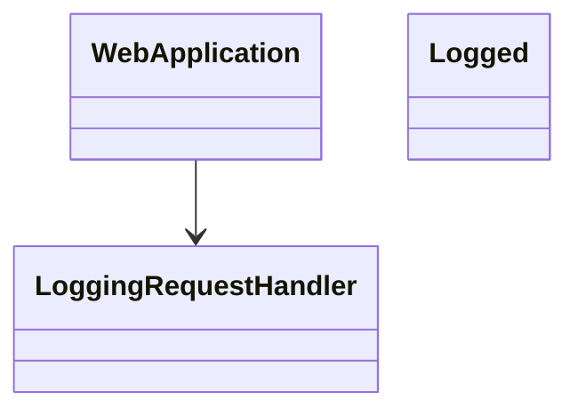

# 類別圖提案：Request/Response Logging

```mermaid
classDiagram
  class WebApplication
  class LoggingRequestHandler
  class Logged
  WebApplication --> LoggingRequestHandler
```

## 設計說明與實作順序

1. 新增 Logged
2. 新增 LoggingRequestHandler
3. 修改 WebApplication
